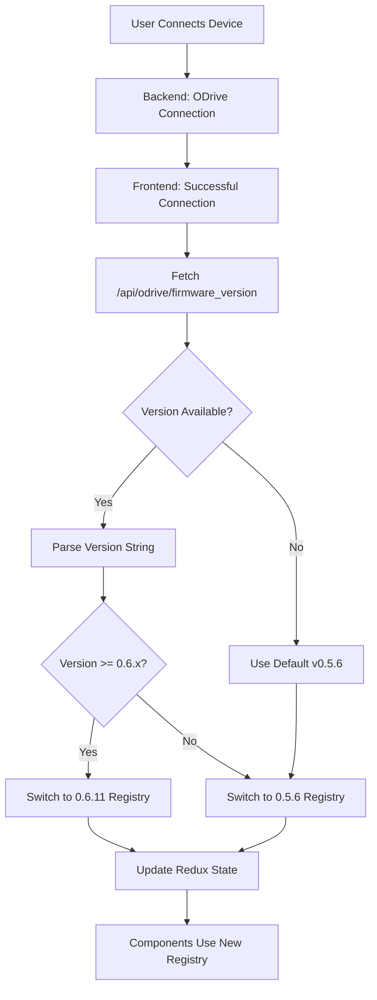

# ODrive Version Detection System

This document explains the automatic firmware version detection and registry management system implemented for ODrive 0.6.11 support.

## Overview

The system automatically detects the firmware version of connected ODrive devices and switches to the appropriate registry (0.5.6 for 0.5.x devices, 0.6.11 for 0.6.x devices) without user intervention.

## Architecture

### 1. Backend Changes (`backend/app/routes/device_routes.py`)
- **New Endpoint**: `/api/odrive/firmware_version`
  - Returns current device firmware version
  - Provides fallback to v0.5.6 if version cannot be read
  - Includes version components (major, minor, revision)

### 2. Frontend State Management (`frontend/src/store/slices/deviceSlice.js`)
- **New State Field**: `firmwareVersion`
- **New Action**: `setFirmwareVersion`
- Automatically cleared on device disconnect
- Stored alongside device connection state

### 3. Registry Management (`frontend/src/utils/registryManager.js`)
- **Central Registry Manager**: Manages version-specific registry instances
- **Automatic Version Parsing**: 
  - `v0.5.x` → Uses `0.5.6` registry
  - `v0.6.x` → Uses `0.6.11` registry
  - Invalid/missing → Defaults to `0.5.6`
- **Registry Caching**: Avoids recreating registries for better performance
- **Proxy Functions**: Seamless integration with existing components

### 4. Component Integration (`frontend/src/components/DeviceList.jsx`)
- **Automatic Detection**: Reads firmware version after successful connection
- **Registry Switching**: Automatically switches registry based on detected version
- **Visual Indication**: Shows firmware version in UI with "FW: v0.x.x" badge
- **Cleanup**: Clears registry state on disconnect

### 5. Consumer Updates
All registry consumers updated to use version-aware system:
- `configBatchApi.js`
- `configChangesDetector.js`
- `presetsManager.js`
- `factoryPresets.js`
- `configCommandGenerator.js`

## Version Detection Flow



## Registry Differences

### ODrive v0.5.6 Properties
- `brake_resistor_armed`
- `brake_resistor_saturated` 
- `brake_resistor_current`
- Traditional brake resistor configuration

### ODrive v0.6.11 Properties
- `bootloader_version`
- `control_loop_hz`
- `test_property`
- `identify`
- `commit_hash`
- `reboot_required`
- Nested `inverter0` configuration
- Enhanced `brake_resistor0` object

## Usage Examples

### Automatic Usage (Normal Operation)
```javascript
// No changes needed in components - registry is automatically selected
const categoryParams = getCategoryParameters('motor')  // Gets version-specific params
const commands = generateCommands('motor', config)      // Uses correct registry
```

### Manual Testing (Development)
```javascript
import { setRegistryVersion, getCurrentRegistry } from './utils/registryManager'

// Manually switch versions for testing
setRegistryVersion('v0.6.11')
const registry = getCurrentRegistry()
console.log(registry.firmwareVersion) // "0.6.11"
```

### Debug Information
```javascript
import { getDebugInfo } from './utils/registryManager'

const info = getDebugInfo()
console.log(info.manager)  // Registry manager state
console.log(info.registry) // Current registry details
```

## Testing

### 1. Automated Testing
Open `registry_test.html` in a browser to test version detection logic.

### 2. Integration Testing
1. Connect an ODrive device
2. Check firmware version badge in device list
3. Verify correct registry is loaded
4. Test configuration and commands work correctly

### 3. Development Testing
```javascript
// In browser console
import('./utils/registryDebugUtils.js').then(({ runInteractiveTest }) => {
    runInteractiveTest()
})
```

## Backward Compatibility

✅ **Full backward compatibility maintained**
- All existing 0.5.x ODrive devices continue to work unchanged
- No configuration migration needed
- Existing presets and configurations remain valid

## Error Handling

- **Connection Errors**: Falls back to v0.5.6 registry
- **Version Read Errors**: Uses default v0.5.6 registry with warning
- **Invalid Versions**: Gracefully parsed to nearest supported version
- **Network Errors**: Maintains current registry until successful reconnection

## Performance

- **Registry Caching**: Registries are created once and cached
- **Lazy Loading**: Registries only created when needed
- **Memory Efficient**: Old registries can be garbage collected
- **Fast Switching**: Version switches are near-instantaneous

## Future Expansion

The system is designed to easily support future ODrive versions:

1. Add version detection logic in `registryManager.parseVersion()`
2. Add new property definitions in `odrivePropertyTree.js`
3. System automatically handles new versions

Example for future v0.7.x support:
```javascript
// In parseVersion()
if (major === 0 && minor >= 7) {
    return '0.7.0'  // Future version
}
```

## Debug Commands

### Browser Console
```javascript
// Check current registry
getCurrentRegistry().getDebugInfo()

// Test version switching
setRegistryVersion('v0.6.11')

// Compare versions
import('./utils/registryDebugUtils.js').then(({ compareVersions }) => compareVersions())
```

### Network Tab
- Monitor `/api/odrive/firmware_version` calls
- Verify version detection timing
- Check fallback behavior

## Troubleshooting

### Issue: Wrong registry being used
**Solution**: Check firmware version badge, verify `/api/odrive/firmware_version` response

### Issue: Version not detected
**Solution**: Check device connection, verify ODrive responds to version queries

### Issue: Registry not switching
**Solution**: Check browser console for errors, verify registryManager imports

### Issue: Old configurations not working
**Solution**: Configurations should work across versions; check parameter name mappings